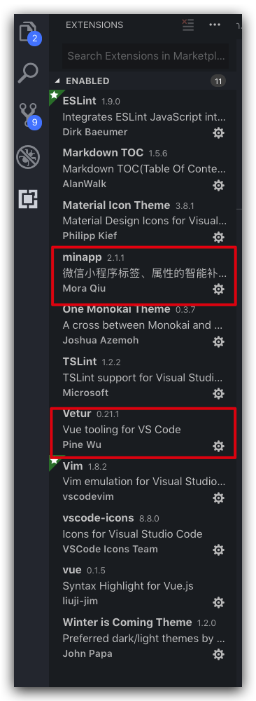
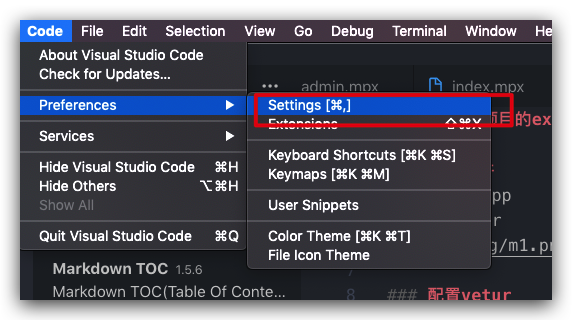
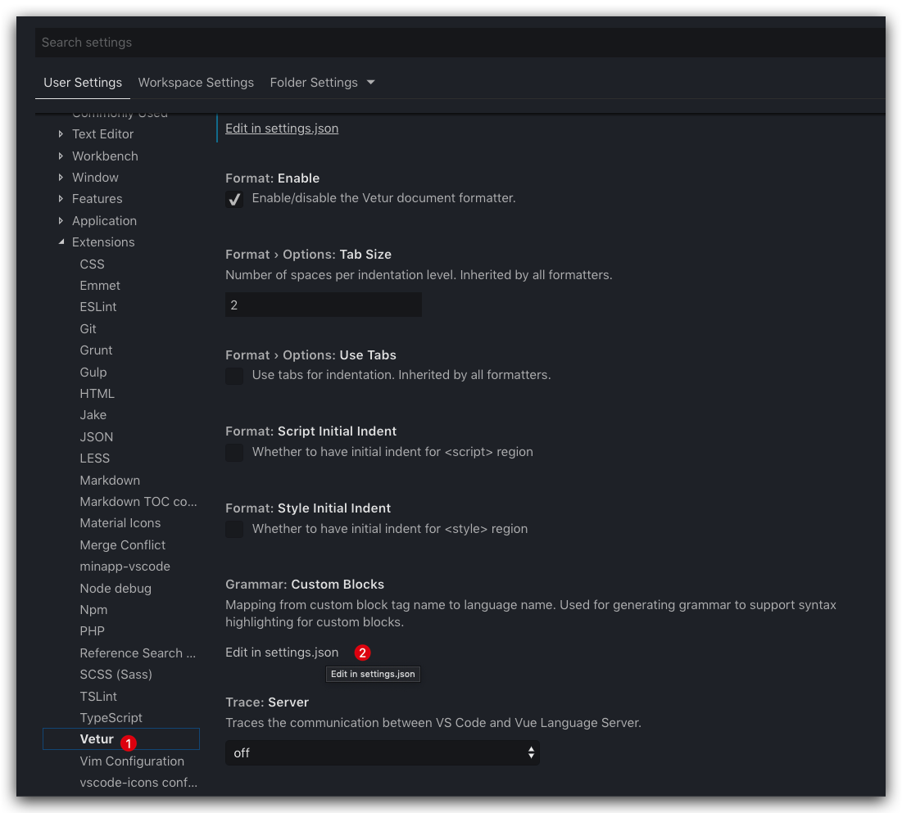
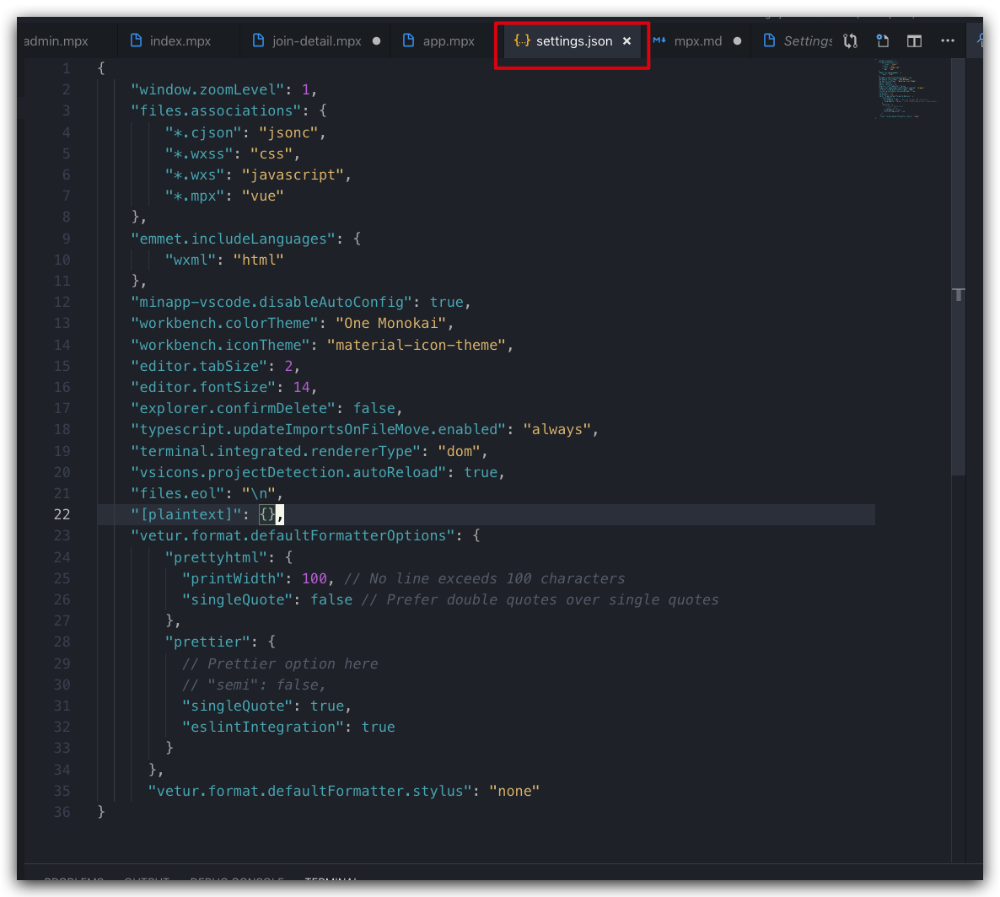
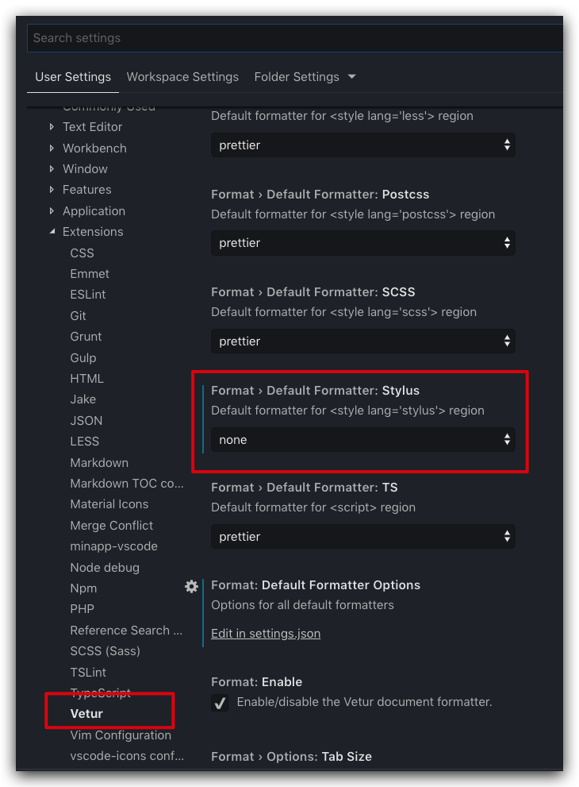

## 配置mpx项目的extension

### 安装插件
- 安装 minapp
- 安装 vetur  



### 配置vetur
因为原生vetur对mpx的支持还没有成熟，我们需要修改一些配置，配合vetur对mpx格式化

#### 修改vetur setting.json
进入code -> Prefence -> Settings  


在User Settings一栏下，进入Extensions,在其中找到Vetur,下滚到`Grammer: Custom Blocks`,点击Edit in `settings.json`。  


将添加部分代码到settings.json里面，
```json
{
    "window.zoomLevel": 1,
    "files.associations": {
        "*.cjson": "jsonc",
        "*.wxss": "css",
        "*.wxs": "javascript",
        "*.mpx": "vue"
    },
    "emmet.includeLanguages": {
        "wxml": "html"
    },
    "minapp-vscode.disableAutoConfig": true,
    "workbench.colorTheme": "One Monokai",
    "workbench.iconTheme": "material-icon-theme",
    "editor.tabSize": 2,
    "editor.fontSize": 14,
    "explorer.confirmDelete": false,
    "typescript.updateImportsOnFileMove.enabled": "always",
    "terminal.integrated.rendererType": "dom",
    "vsicons.projectDetection.autoReload": true,
    "files.eol": "\n",
    "[plaintext]": {},
    "vetur.format.defaultFormatterOptions": {
        "prettyhtml": {
          "printWidth": 100, // No line exceeds 100 characters
          "singleQuote": false // Prefer double quotes over single quotes
        },
        "prettier": {
          // Prettier option here
          "semi": true,
          "singleQuote": true,
          "eslintIntegration": true
        }
      },
      "vetur.format.defaultFormatter.stylus": "none"
}
```



#### 让stylus失效
因为prettyhtml会将mpx的stylus转成css原始格式，我需要设置不起作用。

`Format › Default Formatter: Stylus`选项选为`none`就可以了。



